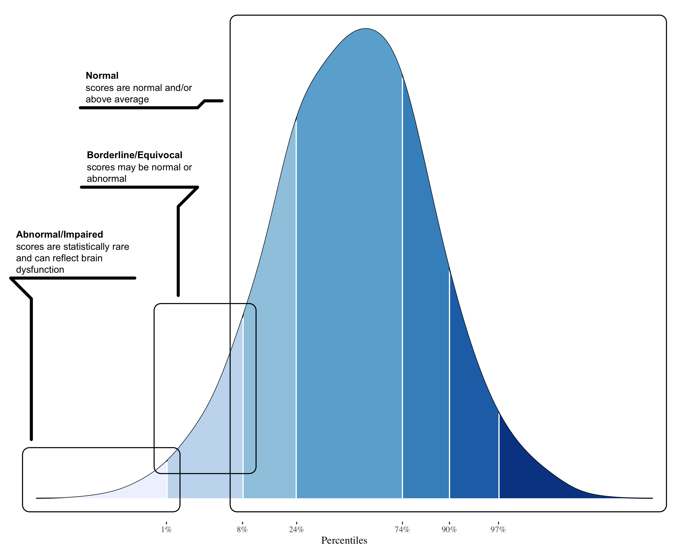

<script src="index_files/libs/htmlwidgets-1.5.4.9001/htmlwidgets.js"></script>
<script src="index_files/libs/jquery-3.5.1/jquery.min.js"></script>
<script src="index_files/libs/proj4js-2.3.15/proj4.js"></script>
<link href="index_files/libs/highcharts-9.3.1/css/motion.css" rel="stylesheet" />
<script src="index_files/libs/highcharts-9.3.1/highcharts.js"></script>
<script src="index_files/libs/highcharts-9.3.1/highcharts-3d.js"></script>
<script src="index_files/libs/highcharts-9.3.1/highcharts-more.js"></script>
<script src="index_files/libs/highcharts-9.3.1/modules/stock.js"></script>
<script src="index_files/libs/highcharts-9.3.1/modules/map.js"></script>
<script src="index_files/libs/highcharts-9.3.1/modules/data.js"></script>
<script src="index_files/libs/highcharts-9.3.1/modules/exporting.js"></script>
<script src="index_files/libs/highcharts-9.3.1/modules/offline-exporting.js"></script>
<script src="index_files/libs/highcharts-9.3.1/modules/drilldown.js"></script>
<script src="index_files/libs/highcharts-9.3.1/modules/item-series.js"></script>
<script src="index_files/libs/highcharts-9.3.1/modules/overlapping-datalabels.js"></script>
<script src="index_files/libs/highcharts-9.3.1/modules/annotations.js"></script>
<script src="index_files/libs/highcharts-9.3.1/modules/export-data.js"></script>
<script src="index_files/libs/highcharts-9.3.1/modules/funnel.js"></script>
<script src="index_files/libs/highcharts-9.3.1/modules/heatmap.js"></script>
<script src="index_files/libs/highcharts-9.3.1/modules/treemap.js"></script>
<script src="index_files/libs/highcharts-9.3.1/modules/sankey.js"></script>
<script src="index_files/libs/highcharts-9.3.1/modules/dependency-wheel.js"></script>
<script src="index_files/libs/highcharts-9.3.1/modules/organization.js"></script>
<script src="index_files/libs/highcharts-9.3.1/modules/solid-gauge.js"></script>
<script src="index_files/libs/highcharts-9.3.1/modules/streamgraph.js"></script>
<script src="index_files/libs/highcharts-9.3.1/modules/sunburst.js"></script>
<script src="index_files/libs/highcharts-9.3.1/modules/vector.js"></script>
<script src="index_files/libs/highcharts-9.3.1/modules/wordcloud.js"></script>
<script src="index_files/libs/highcharts-9.3.1/modules/xrange.js"></script>
<script src="index_files/libs/highcharts-9.3.1/modules/tilemap.js"></script>
<script src="index_files/libs/highcharts-9.3.1/modules/venn.js"></script>
<script src="index_files/libs/highcharts-9.3.1/modules/gantt.js"></script>
<script src="index_files/libs/highcharts-9.3.1/modules/timeline.js"></script>
<script src="index_files/libs/highcharts-9.3.1/modules/parallel-coordinates.js"></script>
<script src="index_files/libs/highcharts-9.3.1/modules/bullet.js"></script>
<script src="index_files/libs/highcharts-9.3.1/modules/coloraxis.js"></script>
<script src="index_files/libs/highcharts-9.3.1/modules/dumbbell.js"></script>
<script src="index_files/libs/highcharts-9.3.1/modules/lollipop.js"></script>
<script src="index_files/libs/highcharts-9.3.1/modules/series-label.js"></script>
<script src="index_files/libs/highcharts-9.3.1/plugins/motion.js"></script>
<script src="index_files/libs/highcharts-9.3.1/custom/reset.js"></script>
<script src="index_files/libs/highcharts-9.3.1/modules/boost.js"></script>
<script src="index_files/libs/highchart-binding-0.9.4/highchart.js"></script>
<script src="index_files/libs/pymjs-1.3.2/pym.v1.js"></script>
<script src="index_files/libs/widgetframe-binding-0.3.1/widgetframe.js"></script>


### Distribution of Scores: *Population-level Interpretation*

``` r
knitr::include_graphics("plot_narrow.png", auto_pdf = TRUE)
```

<figure>

<figcaption aria-hidden="true">Statistical classification of neuropsychological test scores in the general population.</figcaption>
</figure>

### Distribution of Scores: *Clinical-level Interpretation*

``` r
knitr::include_graphics("plot_broad.png", auto_pdf = TRUE)
```

<figure>

<figcaption aria-hidden="true">General clinical interpretation of performance for individual test scores and broader neuropsychological domains</figcaption>
</figure>

### Neuropsychological Testing Results

``` r
neuropsych <-
  read.csv("neuropsych.csv")
neurocog <-
  read.csv("neurocog.csv")
neurobehav <-
  read.csv("neurobehav.csv")
```

``` r
## Level 1
## Domain scores
# 1. create mean z-scores for domain
ncog1 <- neurocog %>%
  tidytable::group_by(domain) %>%
  tidytable::summarize(zMean = mean(z),
    zPct = mean(percentile)) %>%
  tidytable::mutate(range = NA)
ncog1$zMean <- round(ncog1$zMean, 2L)
ncog1$zPct <- round(ncog1$zPct, 0L)
ncog1 <-
  ncog1 %>%
  tidytable::mutate(
    range = tidytable::case_when(
      zPct >= 98 ~ "Exceptionally High",
      zPct %in% 91:97 ~ "Above Average",
      zPct %in% 75:90 ~ "High Average",
      zPct %in% 25:74 ~ "Average",
      zPct %in% 9:24 ~ "Low Average",
      zPct %in% 2:8 ~ "Below Average",
      zPct < 2 ~ "Exceptionally Low",
      TRUE ~ as.character(range)
    )
  )

# 2. sort hi to lo
ncog1 <- arrange(ncog1, desc(zMean))

# 3. create tibble with new column with domain name lowercase
ncog_level1_status <- tibble(
  name = ncog1$domain,
  y = ncog1$zMean,
  y2 = ncog1$zPct,
  range = ncog1$range,
  drilldown = tolower(name)
)
```

``` r
## Level 2
## Subdomain scores
## function to create second level of drilldown (subdomain scores)
ncog_level2_drill <-
  lapply(unique(neurocog$domain), function(x_level) {
    ncog2 <- subset(neurocog, neurocog$domain %in% x_level)

    # same as above
    ncog2 <-
      ncog2 %>%
      group_by(subdomain) %>%
      summarize(zMean = mean(z),
        zPct = mean(percentile)) %>%
      mutate(range = NA)

    # round z-score to 1 decimal
    ncog2$zMean <- round(ncog2$zMean, 2L)
    ncog2$zPct <- round(ncog2$zPct, 0L)
    ncog2 <-
      ncog2 %>%
      tidytable::mutate(
        range = tidytable::case_when(
          zPct >= 98 ~ "Exceptionally High",
          zPct %in% 91:97 ~ "Above Average",
          zPct %in% 75:90 ~ "High Average",
          zPct %in% 25:74 ~ "Average",
          zPct %in% 9:24 ~ "Low Average",
          zPct %in% 2:8 ~ "Below Average",
          zPct < 2 ~ "Exceptionally Low",
          TRUE ~ as.character(range)
        )
      )

    # 2. sort hi to lo
    ncog2 <- arrange(ncog2, desc(zMean))

    # 3. create tibble with new column with domain name lowercase
    ncog_level2_status <- tibble(
      name = ncog2$subdomain,
      y = ncog2$zMean,
      y2 = ncog2$zPct,
      range = ncog2$range,
      drilldown = tolower(paste(x_level, name, sep = "_"))
    )

    list(
      id = tolower(x_level),
      type = "column",
      data = list_parse(ncog_level2_status)
    )
  })
```

``` r
## Level 3
## Narrow subdomains
## reuse function
ncog_level3_drill <-
  lapply(unique(neurocog$domain), function(x_level) {
    ncog2 <- subset(neurocog, neurocog$domain %in% x_level)

    # reuse function but with y_level
    lapply(unique(ncog2$subdomain), function(y_level) {
      # 1. create mean z-scores for subdomain
      # ncog3 becomes pronoun for domain
      ncog3 <- subset(ncog2, ncog2$subdomain %in% y_level)

      ncog3 <- ncog3 %>%
        group_by(narrow) %>%
        summarize(zMean = mean(z), zPct = mean(percentile)) %>%
        mutate(range = NA)

      # round z-score to 1 decimal
      ncog3$zMean <- round(ncog3$zMean, 2L)
      ncog3$zPct <- round(ncog3$zPct, 0L)
      ncog3 <-
        ncog3 %>%
        tidytable::mutate(
          range = tidytable::case_when(
            zPct >= 98 ~ "Exceptionally High",
            zPct %in% 91:97 ~ "Above Average",
            zPct %in% 75:90 ~ "High Average",
            zPct %in% 25:74 ~ "Average",
            zPct %in% 9:24 ~ "Low Average",
            zPct %in% 2:8 ~ "Below Average",
            zPct < 2 ~ "Exceptionally Low",
            TRUE ~ as.character(range)
          )
        )

      ncog3 <- arrange(ncog3, desc(zMean))

      ncog_level3_status <- tibble(
        name = ncog3$narrow,
        y = ncog3$zMean,
        y2 = ncog3$zPct,
        range = ncog3$range,
        drilldown = tolower(paste(x_level, y_level, name, sep = "_"))
      )

      list(
        id = tolower(paste(x_level, y_level, sep = "_")),
        type = "column",
        data = list_parse(ncog_level3_status)
      )
    })
  }) %>% unlist(recursive = FALSE)
```

``` r
## Level 4
## Scale scores
## reuse both functions
ncog_level4_drill <-
  lapply(unique(neurocog$domain), function(x_level) {
    ncog2 <- subset(neurocog, neurocog$domain %in% x_level)

    lapply(unique(ncog2$subdomain), function(y_level) {
      ncog3 <- subset(ncog2, ncog2$subdomain %in% y_level)

      lapply(unique(ncog3$narrow), function(z_level) {
        ncog4 <- subset(ncog3, ncog3$narrow %in% z_level)

        ncog4 <-
          ncog4 %>%
          group_by(scale) %>%
          summarize(zMean = mean(z),
            zPct = mean(percentile)) %>%
          mutate(range = NA)

        # round z-score to 1 decimal
        ncog4$zMean <- round(ncog4$zMean, 2L)
        ncog4$zPct <- round(ncog4$zPct, 0L)
        ncog4 <-
          ncog4 %>%
          tidytable::mutate(
            range = tidytable::case_when(
              zPct >= 98 ~ "Exceptionally High",
              zPct %in% 91:97 ~ "Above Average",
              zPct %in% 75:90 ~ "High Average",
              zPct %in% 25:74 ~ "Average",
              zPct %in% 9:24 ~ "Low Average",
              zPct %in% 2:8 ~ "Below Average",
              zPct < 2 ~ "Exceptionally Low",
              TRUE ~ as.character(range)
            )
          )

        ncog4 <- arrange(ncog4, desc(zMean))

        ncog_level4_status <- tibble(
          name = ncog4$scale,
          y = ncog4$zMean,
          y2 = ncog4$zPct,
          range = ncog4$range
        )

        list(
          id = tolower(paste(x_level, y_level, z_level, sep = "_")),
          type = "column",
          data = list_parse(ncog_level4_status)
        )
      })
    }) %>% unlist(recursive = FALSE)
  }) %>% unlist(recursive = FALSE)
```

``` r
thm_merge <- hc_theme_merge(
  hc_theme_monokai(),
  hc_theme_darkunica()
)
```

``` r
# Tooltip
x <- c("Name", "Score", "Percentile", "Range")
y <- c("{point.name}", "{point.y}", "{point.y2}", "{point.range}")
tt <- tooltip_table(x, y)

## Create drilldown bar plot zscores
plot1 <-
  highchart() %>%
  hc_title(
    text = patient,
    style = list(
      fontSize = "15px")) %>%
  hc_add_series(
    ncog_level1_status,
    type = "bar",
    name = "Neuropsychological Test Scores",
    hcaes(x = name, y = y)) %>%
  hc_xAxis(
    type = "category",
    title = list(
      text = "Domain"),
    categories = .$name) %>%
  hc_yAxis(
    title = list(
      text = "Z-Score (M = 0, SD = 1)"),
    labels = list(
      format = "{value}")) %>%
  hc_tooltip(
    pointFormat = tt,
    useHTML = TRUE,
    valueDecimals = 1) %>%
  hc_plotOptions(
    series = list(
      colorByPoint = TRUE,
      allowPointSelect = TRUE,
      dataLabels = TRUE)) %>%
  hc_drilldown(
    allowPointDrilldown = TRUE,
    series = c(
      ncog_level2_drill,
      ncog_level3_drill,
      ncog_level4_drill)) %>%
  hc_colorAxis(
    minColor = "red",
    maxColor = "blue") %>%
  hc_add_theme(
    thm_merge) %>%
  hc_chart(
    style = list(
      fontFamily = "Cabin"),
    backgroundColor = list("gray")
  )
plot1
```

<div class="highchart html-widget html-fill-item" id="htmlwidget-dad939ba87c31198660b" style="width:768px;height:480px;"></div>
<script type="application/json" data-for="htmlwidget-dad939ba87c31198660b">{"x":{"hc_opts":{"chart":{"reflow":true,"style":{"fontFamily":"Cabin"},"backgroundColor":["gray"]},"title":{"text":"Biggie","style":{"fontSize":"15px"}},"yAxis":{"title":{"text":"Z-Score (M = 0, SD = 1)"},"labels":{"format":"{value}"}},"credits":{"enabled":false},"exporting":{"enabled":false},"boost":{"enabled":false},"plotOptions":{"series":{"label":{"enabled":false},"turboThreshold":0,"colorByPoint":true,"allowPointSelect":true,"dataLabels":true},"treemap":{"layoutAlgorithm":"squarified"}},"series":[{"group":"group","data":[{"name":"Verbal/Language","y":1.34,"y2":85,"range":"High Average","drilldown":"verbal/language"},{"name":"Intelligence/General Ability","y":0.92,"y2":74,"range":"Average","drilldown":"intelligence/general ability"},{"name":"Memory","y":0.64,"y2":72,"range":"Average","drilldown":"memory"},{"name":"Visual Perception/Construction","y":0.48,"y2":66,"range":"Average","drilldown":"visual perception/construction"},{"name":"Attention/Executive","y":0.29,"y2":58,"range":"Average","drilldown":"attention/executive"}],"type":"bar","name":"Neuropsychological Test Scores"}],"xAxis":{"type":"category","title":{"text":"Domain"},"categories":null},"tooltip":{"pointFormat":"<table>\n  <tr>\n    <th>Name<\/th>\n    <td>{point.name}<\/td>\n  <\/tr>\n  <tr>\n    <th>Score<\/th>\n    <td>{point.y}<\/td>\n  <\/tr>\n  <tr>\n    <th>Percentile<\/th>\n    <td>{point.y2}<\/td>\n  <\/tr>\n  <tr>\n    <th>Range<\/th>\n    <td>{point.range}<\/td>\n  <\/tr>\n<\/table>","useHTML":true,"valueDecimals":1},"drilldown":{"allowPointDrilldown":true,"series":[{"id":"memory","type":"column","data":[{"name":"Memory Index","y":1.13,"y2":87,"range":"High Average","drilldown":"memory_memory index"},{"name":"Learning Efficiency","y":0.84,"y2":79,"range":"High Average","drilldown":"memory_learning efficiency"},{"name":"Delayed Recall","y":0.48,"y2":66,"range":"Average","drilldown":"memory_delayed recall"}]},{"id":"attention/executive","type":"column","data":[{"name":"Processing Speed","y":1.27,"y2":81,"range":"High Average","drilldown":"attention/executive_processing speed"},{"name":"Attention Span","y":0.69,"y2":76,"range":"High Average","drilldown":"attention/executive_attention span"},{"name":"Response Monitoring","y":0.19,"y2":57,"range":"Average","drilldown":"attention/executive_response monitoring"},{"name":"Orientation","y":0,"y2":50,"range":"Average","drilldown":"attention/executive_orientation"},{"name":"Working Memory","y":-0.09,"y2":47,"range":"Average","drilldown":"attention/executive_working memory"},{"name":"Attention/Executive","y":-0.15,"y2":46,"range":"Average","drilldown":"attention/executive_attention/executive"},{"name":"Planning","y":-1.53,"y2":9,"range":"Low Average","drilldown":"attention/executive_planning"}]},{"id":"verbal/language","type":"column","data":[{"name":"Acquired Knowledge","y":2.33,"y2":99,"range":"Exceptionally High","drilldown":"verbal/language_acquired knowledge"},{"name":"Fluency","y":1.43,"y2":86,"range":"High Average","drilldown":"verbal/language_fluency"},{"name":"Language Index","y":1.41,"y2":92,"range":"Above Average","drilldown":"verbal/language_language index"},{"name":"Expression","y":0.92,"y2":82,"range":"High Average","drilldown":"verbal/language_expression"},{"name":"Comprehension","y":0.41,"y2":66,"range":"Average","drilldown":"verbal/language_comprehension"}]},{"id":"intelligence/general ability","type":"column","data":[{"name":"General Intelligence","y":2.05,"y2":98,"range":"Exceptionally High","drilldown":"intelligence/general ability_general intelligence"},{"name":"Crystallized Intelligence","y":1.83,"y2":95,"range":"Above Average","drilldown":"intelligence/general ability_crystallized intelligence"},{"name":"Neurocognitive Index","y":0.81,"y2":79,"range":"High Average","drilldown":"intelligence/general ability_neurocognitive index"},{"name":"Processing Speed","y":0.28,"y2":61,"range":"Average","drilldown":"intelligence/general ability_processing speed"},{"name":"Working Memory","y":-0.13,"y2":45,"range":"Average","drilldown":"intelligence/general ability_working memory"},{"name":"Fluid Intelligence","y":-0.2,"y2":42,"range":"Average","drilldown":"intelligence/general ability_fluid intelligence"}]},{"id":"visual perception/construction","type":"column","data":[{"name":"Planning","y":0.7,"y2":76,"range":"High Average","drilldown":"visual perception/construction_planning"},{"name":"Fluid Reasoning","y":0.67,"y2":75,"range":"High Average","drilldown":"visual perception/construction_fluid reasoning"},{"name":"Visual Processing","y":0.35,"y2":58,"range":"Average","drilldown":"visual perception/construction_visual processing"},{"name":"Spatial Index","y":0.33,"y2":63,"range":"Average","drilldown":"visual perception/construction_spatial index"}]},{"id":"memory_learning efficiency","type":"column","data":[{"name":"Story Memory","y":0.99,"y2":84,"range":"High Average","drilldown":"memory_learning efficiency_story memory"},{"name":"Visual Memory","y":0.99,"y2":84,"range":"High Average","drilldown":"memory_learning efficiency_visual memory"},{"name":"Word-List Learning","y":0.78,"y2":78,"range":"High Average","drilldown":"memory_learning efficiency_word-list learning"}]},{"id":"memory_delayed recall","type":"column","data":[{"name":"Story Memory","y":1.34,"y2":91,"range":"Above Average","drilldown":"memory_delayed recall_story memory"},{"name":"Free-Recall Memory","y":0.99,"y2":84,"range":"High Average","drilldown":"memory_delayed recall_free-recall memory"},{"name":"Recognition Memory","y":0.33,"y2":63,"range":"Average","drilldown":"memory_delayed recall_recognition memory"},{"name":"Visual Memory","y":-0.42,"y2":35,"range":"Average","drilldown":"memory_delayed recall_visual memory"}]},{"id":"memory_memory index","type":"column","data":[{"name":"Memory Index","y":1.13,"y2":87,"range":"High Average","drilldown":"memory_memory index_memory index"}]},{"id":"attention/executive_response monitoring","type":"column","data":[{"name":"Response Monitoring","y":0.19,"y2":57,"range":"Average","drilldown":"attention/executive_response monitoring_response monitoring"}]},{"id":"attention/executive_planning","type":"column","data":[{"name":"Planning","y":-1.53,"y2":9,"range":"Low Average","drilldown":"attention/executive_planning_planning"}]},{"id":"attention/executive_attention/executive","type":"column","data":[{"name":"Attention Index","y":0.61,"y2":73,"range":"Average","drilldown":"attention/executive_attention/executive_attention index"},{"name":"Executive Functions Index","y":-0.92,"y2":18,"range":"Low Average","drilldown":"attention/executive_attention/executive_executive functions index"}]},{"id":"attention/executive_orientation","type":"column","data":[{"name":"General Verbal Information","y":0,"y2":50,"range":"Average","drilldown":"attention/executive_orientation_general verbal information"}]},{"id":"attention/executive_attention span","type":"column","data":[{"name":"Verbal Attention","y":0.69,"y2":76,"range":"High Average","drilldown":"attention/executive_attention span_verbal attention"}]},{"id":"attention/executive_working memory","type":"column","data":[{"name":"Verbal Working Memory","y":0.11,"y2":54,"range":"Average","drilldown":"attention/executive_working memory_verbal working memory"},{"name":"Nonverbal Working Memory","y":-0.67,"y2":25,"range":"Average","drilldown":"attention/executive_working memory_nonverbal working memory"}]},{"id":"attention/executive_processing speed","type":"column","data":[{"name":"Psychomotor Speed","y":1.6,"y2":94,"range":"Above Average","drilldown":"attention/executive_processing speed_psychomotor speed"},{"name":"Cognitive Efficiency","y":0.95,"y2":68,"range":"Average","drilldown":"attention/executive_processing speed_cognitive efficiency"}]},{"id":"verbal/language_fluency","type":"column","data":[{"name":"Phonemic Fluency","y":2.58,"y2":100,"range":"Exceptionally High","drilldown":"verbal/language_fluency_phonemic fluency"},{"name":"Semantic Fluency","y":1.1,"y2":86,"range":"High Average","drilldown":"verbal/language_fluency_semantic fluency"},{"name":"Ideational Fluency","y":0.61,"y2":73,"range":"Average","drilldown":"verbal/language_fluency_ideational fluency"}]},{"id":"verbal/language_language index","type":"column","data":[{"name":"Language Index","y":1.41,"y2":92,"range":"Above Average","drilldown":"verbal/language_language index_language index"}]},{"id":"verbal/language_comprehension","type":"column","data":[{"name":"Listening Ability","y":0.41,"y2":66,"range":"Average","drilldown":"verbal/language_comprehension_listening ability"}]},{"id":"verbal/language_expression","type":"column","data":[{"name":"Word Retrieval","y":0.92,"y2":82,"range":"High Average","drilldown":"verbal/language_expression_word retrieval"}]},{"id":"verbal/language_acquired knowledge","type":"column","data":[{"name":"Verbal Reasoning","y":2.33,"y2":99,"range":"Exceptionally High","drilldown":"verbal/language_acquired knowledge_verbal reasoning"}]},{"id":"intelligence/general ability_general intelligence","type":"column","data":[{"name":"General Intelligence","y":2.05,"y2":98,"range":"Exceptionally High","drilldown":"intelligence/general ability_general intelligence_general intelligence"}]},{"id":"intelligence/general ability_crystallized intelligence","type":"column","data":[{"name":"Crystallized Intelligence","y":2.33,"y2":99,"range":"Exceptionally High","drilldown":"intelligence/general ability_crystallized intelligence_crystallized intelligence"},{"name":"Premorbid Ability","y":1.33,"y2":91,"range":"Above Average","drilldown":"intelligence/general ability_crystallized intelligence_premorbid ability"}]},{"id":"intelligence/general ability_fluid intelligence","type":"column","data":[{"name":"Fluid Intelligence","y":-0.2,"y2":42,"range":"Average","drilldown":"intelligence/general ability_fluid intelligence_fluid intelligence"}]},{"id":"intelligence/general ability_working memory","type":"column","data":[{"name":"Working Memory","y":-0.13,"y2":45,"range":"Average","drilldown":"intelligence/general ability_working memory_working memory"}]},{"id":"intelligence/general ability_processing speed","type":"column","data":[{"name":"Processing Speed","y":0.28,"y2":61,"range":"Average","drilldown":"intelligence/general ability_processing speed_processing speed"}]},{"id":"intelligence/general ability_neurocognitive index","type":"column","data":[{"name":"Neurocognitive Index","y":0.81,"y2":79,"range":"High Average","drilldown":"intelligence/general ability_neurocognitive index_neurocognitive index"}]},{"id":"visual perception/construction_spatial index","type":"column","data":[{"name":"Spatial Index","y":0.33,"y2":63,"range":"Average","drilldown":"visual perception/construction_spatial index_spatial index"}]},{"id":"visual perception/construction_visual processing","type":"column","data":[{"name":"Visuoconstruction","y":1.41,"y2":92,"range":"Above Average","drilldown":"visual perception/construction_visual processing_visuoconstruction"},{"name":"Visuoperception","y":-0.71,"y2":24,"range":"Low Average","drilldown":"visual perception/construction_visual processing_visuoperception"}]},{"id":"visual perception/construction_planning","type":"column","data":[{"name":"Perceptual Organization","y":0.7,"y2":76,"range":"High Average","drilldown":"visual perception/construction_planning_perceptual organization"}]},{"id":"visual perception/construction_fluid reasoning","type":"column","data":[{"name":"Inductive Reasoning","y":0.67,"y2":75,"range":"High Average","drilldown":"visual perception/construction_fluid reasoning_inductive reasoning"}]},{"id":"memory_learning efficiency_word-list learning","type":"column","data":[{"name":"Trial 1 Correct","y":0.99,"y2":84,"range":"High Average"},{"name":"Trial 4 Correct","y":0.99,"y2":84,"range":"High Average"},{"name":"Trials 1-4 Correct","y":0.92,"y2":82,"range":"High Average"},{"name":"Trial 3 Correct","y":0.67,"y2":75,"range":"High Average"},{"name":"Trial 2 Correct","y":0.33,"y2":63,"range":"Average"}]},{"id":"memory_learning efficiency_visual memory","type":"column","data":[{"name":"Shape Learning Immediate Recognition","y":0.99,"y2":84,"range":"High Average"}]},{"id":"memory_learning efficiency_story memory","type":"column","data":[{"name":"Story Learning Immediate Recall","y":0.99,"y2":84,"range":"High Average"}]},{"id":"memory_delayed recall_free-recall memory","type":"column","data":[{"name":"Long Delay Cued Recall","y":0.99,"y2":84,"range":"High Average"},{"name":"Long Delay Free Recall","y":0.99,"y2":84,"range":"High Average"},{"name":"Short Delay Free Recall","y":0.99,"y2":84,"range":"High Average"}]},{"id":"memory_delayed recall_recognition memory","type":"column","data":[{"name":"Recognition Discriminability (d')","y":0.67,"y2":75,"range":"High Average"},{"name":"Recognition Discriminability Nonparametric","y":0.33,"y2":63,"range":"Average"},{"name":"Total Hits","y":0.33,"y2":63,"range":"Average"},{"name":"Total False Positives","y":0,"y2":50,"range":"Average"}]},{"id":"memory_delayed recall_visual memory","type":"column","data":[{"name":"Shape Learning Delayed Recognition","y":0.2,"y2":58,"range":"Average"},{"name":"Shape Learning Percent Retention","y":-0.67,"y2":25,"range":"Average"},{"name":"ROCFT Delayed Recall","y":-0.8,"y2":21,"range":"Low Average"}]},{"id":"memory_delayed recall_story memory","type":"column","data":[{"name":"Story Learning Delayed Recall","y":1.41,"y2":92,"range":"Above Average"},{"name":"Story Learning Percent Retention","y":1.28,"y2":90,"range":"High Average"}]},{"id":"memory_memory index_memory index","type":"column","data":[{"name":"NAB Memory Index","y":1.13,"y2":87,"range":"High Average"}]},{"id":"attention/executive_response monitoring_response monitoring","type":"column","data":[{"name":"Total Intrusions","y":0.67,"y2":75,"range":"High Average"},{"name":"Word Generation Perseverations","y":0,"y2":50,"range":"Average"},{"name":"Numbers & Letters Part A Errors","y":-0.1,"y2":46,"range":"Average"}]},{"id":"attention/executive_planning_planning","type":"column","data":[{"name":"Unstructured Task","y":-1,"y2":16,"range":"Low Average"},{"name":"Mazes","y":-2.05,"y2":2,"range":"Below Average"}]},{"id":"attention/executive_attention/executive_attention index","type":"column","data":[{"name":"NAB Attention Index","y":0.61,"y2":73,"range":"Average"}]},{"id":"attention/executive_attention/executive_executive functions index","type":"column","data":[{"name":"NAB Executive Functions Index","y":-0.92,"y2":18,"range":"Low Average"}]},{"id":"attention/executive_orientation_general verbal information","type":"column","data":[{"name":"Orientation","y":0,"y2":50,"range":"Average"}]},{"id":"attention/executive_attention span_verbal attention","type":"column","data":[{"name":"Digits Forward","y":0.71,"y2":76,"range":"High Average"},{"name":"Digits Forward Longest Span","y":0.67,"y2":75,"range":"High Average"}]},{"id":"attention/executive_working memory_verbal working memory","type":"column","data":[{"name":"Letter-Number Sequencing","y":0.33,"y2":63,"range":"Average"},{"name":"Digits Backward","y":0,"y2":50,"range":"Average"},{"name":"Digits Backward Longest Span","y":0,"y2":50,"range":"Average"}]},{"id":"attention/executive_working memory_nonverbal working memory","type":"column","data":[{"name":"Symbol Span","y":-0.67,"y2":25,"range":"Average"}]},{"id":"attention/executive_processing speed_psychomotor speed","type":"column","data":[{"name":"Numbers & Letters Part A Efficiency","y":1.75,"y2":96,"range":"Above Average"},{"name":"Numbers & Letters Part A Speed","y":1.75,"y2":96,"range":"Above Average"},{"name":"Trails A","y":1.3,"y2":90,"range":"High Average"}]},{"id":"attention/executive_processing speed_cognitive efficiency","type":"column","data":[{"name":"Coding","y":2.65,"y2":100,"range":"Exceptionally High"},{"name":"Trails B","y":0.8,"y2":79,"range":"High Average"},{"name":"Numbers & Letters Part B Efficiency","y":-0.61,"y2":27,"range":"Average"}]},{"id":"verbal/language_fluency_phonemic fluency","type":"column","data":[{"name":"Letter Fluency","y":2.58,"y2":100,"range":"Exceptionally High"}]},{"id":"verbal/language_fluency_semantic fluency","type":"column","data":[{"name":"Category Fluency","y":1.1,"y2":86,"range":"High Average"}]},{"id":"verbal/language_fluency_ideational fluency","type":"column","data":[{"name":"Word Generation","y":0.61,"y2":73,"range":"Average"}]},{"id":"verbal/language_language index_language index","type":"column","data":[{"name":"NAB Language Index","y":1.41,"y2":92,"range":"Above Average"}]},{"id":"verbal/language_comprehension_listening ability","type":"column","data":[{"name":"Auditory Comprehension","y":0.41,"y2":66,"range":"Average"}]},{"id":"verbal/language_expression_word retrieval","type":"column","data":[{"name":"Naming","y":0.92,"y2":82,"range":"High Average"}]},{"id":"verbal/language_acquired knowledge_verbal reasoning","type":"column","data":[{"name":"Similarities","y":2.33,"y2":99,"range":"Exceptionally High"}]},{"id":"intelligence/general ability_general intelligence_general intelligence","type":"column","data":[{"name":"General Intelligence","y":2.05,"y2":98,"range":"Exceptionally High"}]},{"id":"intelligence/general ability_crystallized intelligence_crystallized intelligence","type":"column","data":[{"name":"Crystallized Knowledge","y":2.33,"y2":99,"range":"Exceptionally High"}]},{"id":"intelligence/general ability_crystallized intelligence_premorbid ability","type":"column","data":[{"name":"TOPF Standard Score","y":1.33,"y2":91,"range":"Above Average"}]},{"id":"intelligence/general ability_fluid intelligence_fluid intelligence","type":"column","data":[{"name":"Fluid Reasoning","y":-0.2,"y2":42,"range":"Average"}]},{"id":"intelligence/general ability_working memory_working memory","type":"column","data":[{"name":"Working Memory","y":-0.13,"y2":45,"range":"Average"}]},{"id":"intelligence/general ability_processing speed_processing speed","type":"column","data":[{"name":"Processing Speed","y":0.28,"y2":61,"range":"Average"}]},{"id":"intelligence/general ability_neurocognitive index_neurocognitive index","type":"column","data":[{"name":"NAB Total Index","y":0.81,"y2":79,"range":"High Average"}]},{"id":"visual perception/construction_spatial index_spatial index","type":"column","data":[{"name":"NAB Spatial Index","y":0.33,"y2":63,"range":"Average"}]},{"id":"visual perception/construction_visual processing_visuoperception","type":"column","data":[{"name":"Visual Discrimination","y":-0.71,"y2":24,"range":"Low Average"}]},{"id":"visual perception/construction_visual processing_visuoconstruction","type":"column","data":[{"name":"Design Construction","y":1.41,"y2":92,"range":"Above Average"}]},{"id":"visual perception/construction_planning_perceptual organization","type":"column","data":[{"name":"ROCFT Copy","y":0.7,"y2":76,"range":"High Average"}]},{"id":"visual perception/construction_fluid reasoning_inductive reasoning","type":"column","data":[{"name":"Matrix Reasoning","y":0.67,"y2":75,"range":"High Average"}]}]},"colorAxis":{"minColor":"red","maxColor":"blue"}},"theme":{"colors":["#2b908f","#90ee7e","#f45b5b","#7798BF","#aaeeee","#ff0066","#eeaaee","#55BF3B"],"chart":{"backgroundColor":{"linearGradient":{"x1":0,"y1":0,"x2":1,"y2":1},"stops":[[0,"#2a2a2b"],[1,"#3e3e40"]]},"style":{"fontFamily":"Unica One, sans-serif","color":"#A2A39C"},"plotBorderColor":"#606063"},"title":{"style":{"color":"#E0E0E3","textTransform":"uppercase","fontSize":"20px"},"align":"left"},"subtitle":{"style":{"color":"#E0E0E3","textTransform":"uppercase"},"align":"left"},"legend":{"align":"right","verticalAlign":"bottom","itemStyle":{"fontWeight":"normal","color":"#E0E0E3"},"itemHoverStyle":{"color":"#FFF"},"itemHiddenStyle":{"color":"#606063"}},"xAxis":{"gridLineDashStyle":"Dot","gridLineWidth":1,"gridLineColor":"#707073","lineColor":"#707073","minorGridLineColor":"#505053","tickColor":"#707073","tickWidth":1,"labels":{"style":{"color":"#E0E0E3"}},"title":{"style":{"color":"#A0A0A3"}}},"yAxis":{"gridLineDashStyle":"Dot","gridLineColor":"#707073","lineColor":"#707073","minorGridLineColor":"#505053","tickColor":"#707073","tickWidth":1,"labels":{"style":{"color":"#E0E0E3"}},"title":{"style":{"color":"#A0A0A3"}}},"tooltip":{"backgroundColor":"rgba(0, 0, 0, 0.85)","style":{"color":"#F0F0F0"}},"plotOptions":{"series":{"dataLabels":{"color":"#B0B0B3"},"marker":{"lineColor":"#333"}},"boxplot":{"fillColor":"#505053"},"candlestick":{"lineColor":"white"},"errorbar":{"color":"white"}},"credits":{"style":{"color":"#666"}},"labels":{"style":{"color":"#707073"}},"drilldown":{"activeAxisLabelStyle":{"color":"#F0F0F3"},"activeDataLabelStyle":{"color":"#F0F0F3"}},"navigation":{"buttonOptions":{"symbolStroke":"#DDDDDD","theme":{"fill":"#505053"}}},"rangeSelector":{"buttonTheme":{"fill":"#505053","stroke":"#000000","style":{"color":"#CCC"},"states":{"hover":{"fill":"#707073","stroke":"#000000","style":{"color":"white"}},"select":{"fill":"#000003","stroke":"#000000","style":{"color":"white"}}}},"inputBoxBorderColor":"#505053","inputStyle":{"backgroundColor":"#333","color":"silver"},"labelStyle":{"color":"silver"}},"navigator":{"handles":{"backgroundColor":"#666","borderColor":"#AAA"},"outlineColor":"#CCC","maskFill":"rgba(255,255,255,0.1)","series":{"color":"#7798BF","lineColor":"#A6C7ED"},"xAxis":{"gridLineColor":"#505053"}},"scrollbar":{"barBackgroundColor":"#808083","barBorderColor":"#808083","buttonArrowColor":"#CCC","buttonBackgroundColor":"#606063","buttonBorderColor":"#606063","rifleColor":"#FFF","trackBackgroundColor":"#404043","trackBorderColor":"#404043"},"legendBackgroundColor":"rgba(0, 0, 0, 0.5)","background2":"#505053","dataLabelsColor":"#B0B0B3","textColor":"#C0C0C0","contrastTextColor":"#F0F0F3","maskColor":"rgba(255,255,255,0.3)"},"conf_opts":{"global":{"Date":null,"VMLRadialGradientURL":"http =//code.highcharts.com/list(version)/gfx/vml-radial-gradient.png","canvasToolsURL":"http =//code.highcharts.com/list(version)/modules/canvas-tools.js","getTimezoneOffset":null,"timezoneOffset":0,"useUTC":true},"lang":{"contextButtonTitle":"Chart context menu","decimalPoint":".","downloadCSV":"Download CSV","downloadJPEG":"Download JPEG image","downloadPDF":"Download PDF document","downloadPNG":"Download PNG image","downloadSVG":"Download SVG vector image","downloadXLS":"Download XLS","drillUpText":"◁ Back to {series.name}","exitFullscreen":"Exit from full screen","exportData":{"annotationHeader":"Annotations","categoryDatetimeHeader":"DateTime","categoryHeader":"Category"},"hideData":"Hide data table","invalidDate":null,"loading":"Loading...","months":["January","February","March","April","May","June","July","August","September","October","November","December"],"noData":"No data to display","numericSymbolMagnitude":1000,"numericSymbols":["k","M","G","T","P","E"],"printChart":"Print chart","resetZoom":"Reset zoom","resetZoomTitle":"Reset zoom level 1:1","shortMonths":["Jan","Feb","Mar","Apr","May","Jun","Jul","Aug","Sep","Oct","Nov","Dec"],"shortWeekdays":["Sat","Sun","Mon","Tue","Wed","Thu","Fri"],"thousandsSep":" ","viewData":"View data table","viewFullscreen":"View in full screen","weekdays":["Sunday","Monday","Tuesday","Wednesday","Thursday","Friday","Saturday"]}},"type":"chart","fonts":["Unica+One","Cabin"],"debug":false},"evals":[],"jsHooks":[]}</script>

HighchartR Drilldown

### Behavioral Ratings Results

``` r
## Level 1
## Domain scores
# 1. create mean z-scores for domain
nbhv1 <- neurobehav %>%
  tidytable::group_by(domain) %>%
  tidytable::summarize(zMean = mean(z),
    zPct = mean(percentile)) %>%
  tidytable::mutate(range = NA)
nbhv1$zMean <- round(nbhv1$zMean, 0L)
nbhv1$zPct <- round(nbhv1$zPct, 0L)
nbhv1 <-
  nbhv1 %>%
  tidytable::mutate(
    range = tidytable::case_when(
      # zMean >= -1.1 &
      #   domain %in% c("Adaptive Skills", "Personal Adjustment") ~ "Strength",
      # zMean %in% -1:0.9 &
      #   domain %in% c("Adaptive Skills", "Personal Adjustment") ~ "WNL",
      # zMean %in% -2:-2.9 &
      #   domain %in% c("Adaptive Skills", "Personal Adjustment") ~ "Mildly Elevated",
      # zMean %in% -3:-3.9 &
      #   domain %in% c("Adaptive Skills", "Personal Adjustment") ~ "Significantly Elevated",
      # zMean <= -4 &
      #   domain %in% c("Adaptive Skills", "Personal Adjustment") ~ "Markedly Elevated",
      # zMean >= 4 &
      #   domain != c("Adaptive Skills", "Personal Adjustment") ~ "Markedly Elevated",
      # zMean %in% 3:3.9 &
      #   domain != c("Adaptive Skills", "Personal Adjustment") ~ "Significantly Elevated",
      # zMean %in% 2:2.9 &
      #   domain != c("Adaptive Skills", "Personal Adjustment") ~ "Mildly Elevated",
      # zMean %in% -1:1.9 &
      #   domain != c("Adaptive Skills", "Personal Adjustment") ~ "WNL",
      # zMean <= -1.1 &
      #   domain != c("Adaptive Skills", "Personal Adjustment") ~ "Strength",
      zMean >= 3 ~ "Markedly Elevated",
      zMean %in% 2:2.9 ~ "Significantly Elevated",
      zMean %in% 1:1.9 ~ "Mildly Elevated",
      zMean %in% -1:0.9 ~ "Average",
      zMean <= -1.1 ~ "Below Average",
      # zPct > 99 ~ "Markedly Elevated",
      # zPct %in% 98:99 ~ "Significantly Elevated",
      # zPct %in% 84:97 ~ "Mildly Elevated",
      # zPct %in% 16:83 ~ "WNL",
      # zPct <= 82 ~ "Below Average",
      TRUE ~ as.character(range)
    )
  )

# 2. sort hi to lo
nbhv1 <- arrange(nbhv1, desc(zMean))

# 3. create tibble with new column with domain name lowercase
nbhv_level1_status <- tibble(
  name = nbhv1$domain,
  y = nbhv1$zMean,
  y2 = nbhv1$zPct,
  range = nbhv1$range,
  drilldown = tolower(name)
)
```

``` r
## Level 2
## Subdomain scores
## function to create second level of drilldown (subdomain scores)
nbhv_level2_drill <-
  lapply(unique(neurobehav$domain), function(x_level) {
    nbhv2 <- subset(neurobehav, neurobehav$domain %in% x_level)

    # same as above
    nbhv2 <-
      nbhv2 %>%
      group_by(subdomain) %>%
      summarize(zMean = mean(z),
        zPct = mean(percentile)) %>%
      mutate(range = NA)

    # round z-score to 1 decimal
    nbhv2$zMean <- round(nbhv2$zMean, 0L)
    nbhv2$zPct <- round(nbhv2$zPct, 0L)
    nbhv2 <-
      nbhv2 %>%
      tidytable::mutate(
        range = tidytable::case_when(
          # zMean >= 1 &
          #   name %in% c("Adaptive Skills", "Personal Adjustment") ~ "Strength",
          # zMean %in% -1:0.9 &
          #   name %in% c("Adaptive Skills", "Personal Adjustment") ~ "WNL",
          # zMean %in% -2:-2.9 &
          #   name %in% c("Adaptive Skills", "Personal Adjustment") ~ "Mildly Elevated",
          # zMean %in% -3:-3.9 &
          #   name %in% c("Adaptive Skills", "Personal Adjustment") ~ "Significantly Elevated",
          # zMean <= -4 &
          #   name %in% c("Adaptive Skills", "Personal Adjustment") ~ "Markedly Elevated",
          # zMean >= 4 &
          #   name != c("Adaptive Skills", "Personal Adjustment") ~ "Markedly Elevated",
          # zMean %in% 3:3.9 &
          #   name != c("Adaptive Skills", "Personal Adjustment") ~ "Significantly Elevated",
          # zMean %in% 2:2.9 &
          #   name != c("Adaptive Skills", "Personal Adjustment") ~ "Mildly Elevated",
          # zMean %in% -1:1.9 &
          #   name != c("Adaptive Skills", "Personal Adjustment") ~ "WNL",
          # zMean <= -1.1 &
          #   name != c("Adaptive Skills", "Personal Adjustment") ~ "Strength",
          zMean >= 3 ~ "Markedly Elevated",
          zMean %in% 2:2.9 ~ "Significantly Elevated",
          zMean %in% 1:1.9 ~ "Mildly Elevated",
          zMean %in% -1:0.9 ~ "Average",
          zMean <= -1.1 ~ "Below Average",
          TRUE ~ as.character(range)
        )
      )

    # 2. sort hi to lo
    nbhv2 <- arrange(nbhv2, desc(zMean))

    # 3. create tibble with new column with domain name lowercase
    nbhv_level2_status <- tibble(
      name = nbhv2$subdomain,
      y = nbhv2$zMean,
      y2 = nbhv2$zPct,
      range = nbhv2$range,
      drilldown = tolower(paste(x_level, name, sep = "_"))
    )

    list(
      id = tolower(x_level),
      type = "column",
      data = list_parse(nbhv_level2_status)
    )
  })
```

``` r
## Level 3
## Narrow subdomains
## reuse function
nbhv_level3_drill <-
  lapply(unique(neurobehav$domain), function(x_level) {
    nbhv2 <- subset(neurobehav, neurobehav$domain %in% x_level)

    # reuse function but with y_level
    lapply(unique(nbhv2$subdomain), function(y_level) {
      # 1. create mean z-scores for subdomain
      # nbhv3 becomes pronoun for domain
      nbhv3 <- subset(nbhv2, nbhv2$subdomain %in% y_level)

      nbhv3 <- nbhv3 %>%
        group_by(narrow) %>%
        summarize(zMean = mean(z), zPct = mean(percentile)) %>%
        mutate(range = NA)

      # round z-score to 1 decimal
      nbhv3$zMean <- round(nbhv3$zMean, 0L)
      nbhv3$zPct <- round(nbhv3$zPct, 0L)
      nbhv3 <-
        nbhv3 %>%
        tidytable::mutate(
          range = tidytable::case_when(
            # zMean >= 1 &
            #   name %in% c("Adaptive Skills", "Personal Adjustment") ~ "Strength",
            # zMean %in% -1:0.9 &
            #   name %in% c("Adaptive Skills", "Personal Adjustment") ~ "WNL",
            # zMean %in% -2:-2.9 &
            #   name %in% c("Adaptive Skills", "Personal Adjustment") ~ "Mildly Elevated",
            # zMean %in% -3:-3.9 &
            #   name %in% c("Adaptive Skills", "Personal Adjustment") ~ "Significantly Elevated",
            # zMean <= -4 &
            #   name %in% c("Adaptive Skills", "Personal Adjustment") ~ "Markedly Elevated",
            # zMean >= 4 &
            #   name != c("Adaptive Skills", "Personal Adjustment") ~ "Markedly Elevated",
            # zMean %in% 3:3.9 &
            #   name != c("Adaptive Skills", "Personal Adjustment") ~ "Significantly Elevated",
            # zMean %in% 2:2.9 &
            #   name != c("Adaptive Skills", "Personal Adjustment") ~ "Mildly Elevated",
            # zMean %in% -1:1.9 &
            #   name != c("Adaptive Skills", "Personal Adjustment") ~ "WNL",
            # zMean <= -1.1 &
            #   name != c("Adaptive Skills", "Personal Adjustment") ~ "Strength",
            zMean >= 3 ~ "Markedly Elevated",
            zMean %in% 2:2.9 ~ "Significantly Elevated",
            zMean %in% 1:1.9 ~ "Mildly Elevated",
            zMean %in% -1:0.9 ~ "Average",
            zMean <= -1.1 ~ "Below Average",
            TRUE ~ as.character(range)
          )
        )

      nbhv3 <- arrange(nbhv3, desc(zMean))

      nbhv_level3_status <- tibble(
        name = nbhv3$narrow,
        y = nbhv3$zMean,
        y2 = nbhv3$zPct,
        range = nbhv3$range,
        drilldown = tolower(paste(x_level, y_level, name, sep = "_"))
      )

      list(
        id = tolower(paste(x_level, y_level, sep = "_")),
        type = "column",
        data = list_parse(nbhv_level3_status)
      )
    })
  }) %>% unlist(recursive = FALSE)
```

``` r
## Level 4
## Scale scores
## reuse both functions
nbhv_level4_drill <-
  lapply(unique(neurobehav$domain), function(x_level) {
    nbhv2 <- subset(neurobehav, neurobehav$domain %in% x_level)

    lapply(unique(nbhv2$subdomain), function(y_level) {
      nbhv3 <- subset(nbhv2, nbhv2$subdomain %in% y_level)

      lapply(unique(nbhv3$narrow), function(z_level) {
        nbhv4 <- subset(nbhv3, nbhv3$narrow %in% z_level)

        nbhv4 <-
          nbhv4 %>%
          group_by(scale) %>%
          summarize(zMean = mean(z),
            zPct = mean(percentile)) %>%
          mutate(range = NA)

        # round z-score to 1 decimal
        nbhv4$zMean <- round(nbhv4$zMean, 0L)
        nbhv4$zPct <- round(nbhv4$zPct, 0L)
        nbhv4 <-
          nbhv4 %>%
          tidytable::mutate(
            range = tidytable::case_when(
              # zMean >= 1 &
              #   name %in% c("Adaptive Skills", "Personal Adjustment") ~ "Strength",
              # zMean %in% -1:0.9 &
              #   name %in% c("Adaptive Skills", "Personal Adjustment") ~ "WNL",
              # zMean %in% -2:-2.9 &
              #   name %in% c("Adaptive Skills", "Personal Adjustment") ~ "Mildly Elevated",
              # zMean %in% -3:-3.9 &
              #   name %in% c("Adaptive Skills", "Personal Adjustment") ~ "Significantly Elevated",
              # zMean <= -4 &
              #   name %in% c("Adaptive Skills", "Personal Adjustment") ~ "Markedly Elevated",
              # zMean >= 4 &
              #   name != c("Adaptive Skills", "Personal Adjustment") ~ "Markedly Elevated",
              # zMean %in% 3:3.9 &
              #   name != c("Adaptive Skills", "Personal Adjustment") ~ "Significantly Elevated",
              # zMean %in% 2:2.9 &
              #   name != c("Adaptive Skills", "Personal Adjustment") ~ "Mildly Elevated",
              # zMean %in% -1:1.9 &
              #   name != c("Adaptive Skills", "Personal Adjustment") ~ "WNL",
              # zMean <= -1.1 &
              #   name != c("Adaptive Skills", "Personal Adjustment") ~ "Strength",
              zMean >= 3 ~ "Markedly Elevated",
              zMean %in% 2:2.9 ~ "Significantly Elevated",
              zMean %in% 1:1.9 ~ "Mildly Elevated",
              zMean %in% -1:0.9 ~ "Average",
              zMean <= -1.1 ~ "Below Average",
              TRUE ~ as.character(range)
            )
          )

        nbhv4 <- arrange(nbhv4, desc(zMean))

        nbhv_level4_status <- tibble(
          name = nbhv4$scale,
          y = nbhv4$zMean,
          y2 = nbhv4$zPct,
          range = nbhv4$range
        )

        list(
          id = tolower(paste(x_level, y_level, z_level, sep = "_")),
          type = "column",
          data = list_parse(nbhv_level4_status)
        )
      })
    }) %>% unlist(recursive = FALSE)
  }) %>% unlist(recursive = FALSE)
```

``` r
thm_merge <- hc_theme_merge(
  hc_theme_monokai(),
  hc_theme_darkunica()
)
```

``` r
# Tooltip
x <- c("Name", "Score", "Percentile", "Range")
y <- c("{point.name}", "{point.y}", "{point.y2}", "{point.range}")
tt <- tooltip_table(x, y)

## Create drilldown bar plot zscores
plot2 <-
  highchart() %>%
  hc_title(
    text = patient,
    style = list(
      fontSize = "15px")) %>%
  hc_add_series(
    nbhv_level1_status,
    type = "bar",
    name = "Behavioral Rating Scales",
    hcaes(x = name, y = y)) %>%
  hc_xAxis(
    type = "category",
    title = list(
      text = "Domain"),
    categories = .$name) %>%
  hc_yAxis(
    title = list(
      text = "Z-Score (M = 0, SD = 1)"),
    labels = list(
      format = "{value}")) %>%
  hc_tooltip(
    pointFormat = tt,
    useHTML = TRUE,
    valueDecimals = 1) %>%
  hc_plotOptions(
    series = list(
      colorByPoint = TRUE,
      allowPointSelect = TRUE,
      dataLabels = TRUE)) %>%
  hc_drilldown(
    allowPointDrilldown = TRUE,
    series = c(
      nbhv_level2_drill,
      nbhv_level3_drill,
      nbhv_level4_drill)) %>%
  hc_colorAxis(
    minColor = "red",
    maxColor = "blue") %>%
  hc_add_theme(
    thm_merge) %>%
  hc_chart(
    style = list(
      fontFamily = "Cabin"),
    backgroundColor = list("gray")
  )
frameWidget(plot2)
```

<div id="htmlwidget-b221ca9b9c12920388dc" style="width:100%;height:480px;" class="widgetframe html-widget"></div>
<script type="application/json" data-for="htmlwidget-b221ca9b9c12920388dc">{"x":{"url":"index.markdown_strict_files/figure-markdown_strict//widgets/widget_drilldown2-plot.html","options":{"xdomain":"*","allowfullscreen":false,"lazyload":false}},"evals":[],"jsHooks":[]}</script>

HighchartR Drilldown
